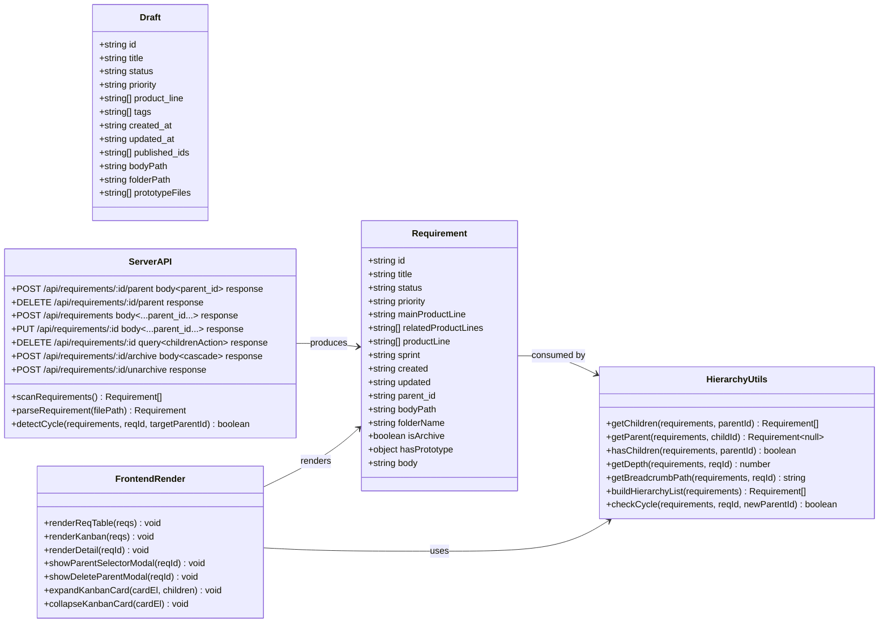
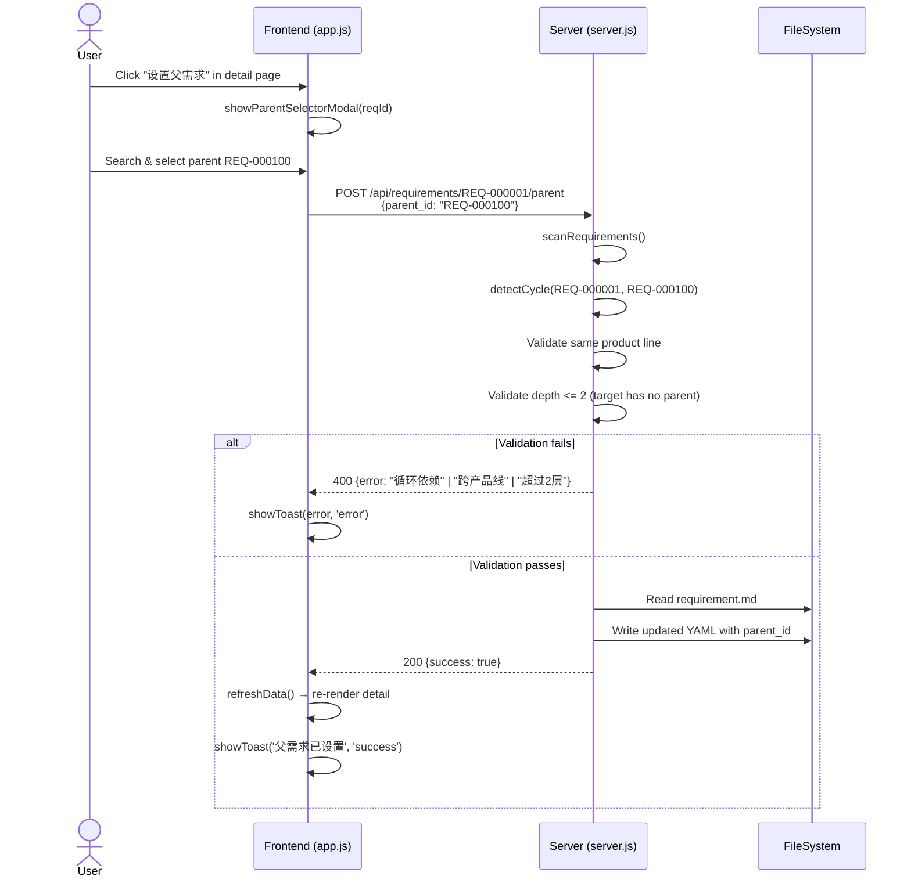
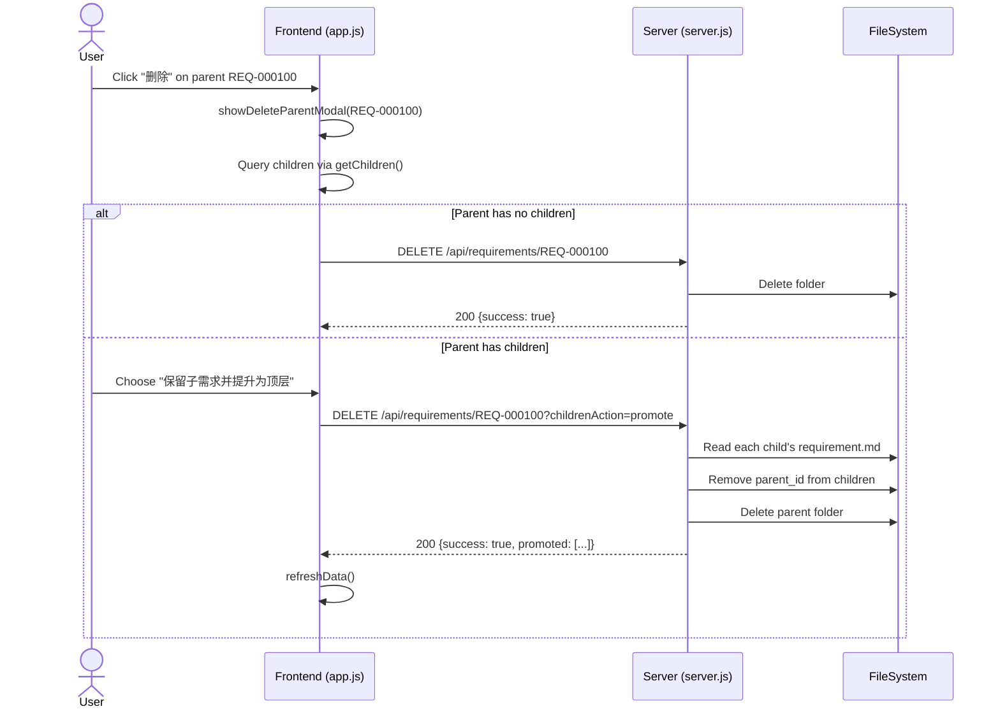
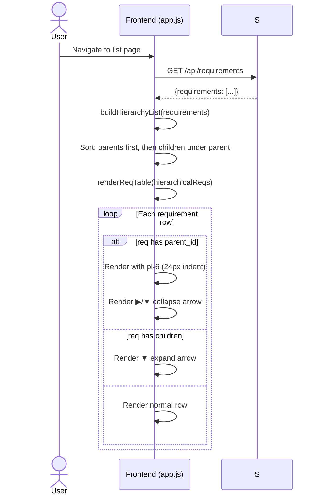
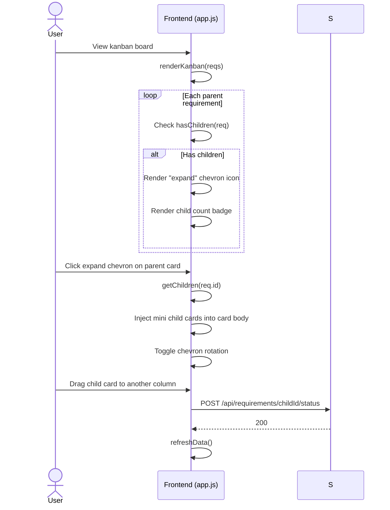
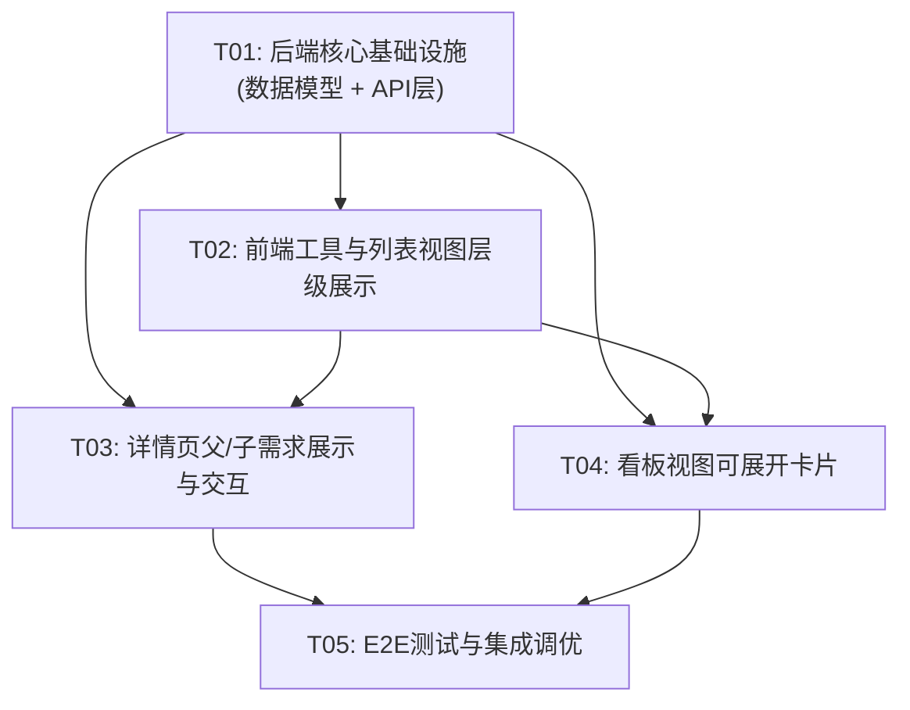

# 父子需求层级功能 — 系统架构设计文档

## Part A: System Design

### 1. Implementation Approach

#### 1.1 Core Technical Challenges

| Challenge | Description | Solution |
|---|---|---|
| Cycle Detection | Setting `parent_id` must not create circular dependencies | Recursive upward traversal with 50-level safety limit |
| Child Query | Only `parent_id` stored; children must be found dynamically | Frontend builds an in-memory adjacency list from `scanRequirements()` |
| 2-Level Depth Limit | Must enforce max 2 layers (parent → child, no grandchildren | Validate on `parent_id` assignment: reject if target parent already has a parent |
| Cross-Product-Line Block | Parent and child must share the same `mainProductLine` | Backend validation on save |
| Kanban Expandable Cards | Parent cards need embedded child mini-cards | Pure CSS/JS expand/collapse with inline DOM injection |
| Delete Parent Handling | Children must be promoted or deleted together | Backend API accepts `childrenAction` param; frontend shows modal |
| Archive Cascade | Archiving parent should optionally archive children | Backend cascade logic with frontend prompt |

#### 1.2 Framework and Library Selection

| Layer | Technology | Justification |
|---|---|---|
| Backend | Node.js + Express (existing) | No change needed; feature is pure CRUD extension |
| Frontend | Vanilla JS + Tailwind CSS CDN (existing) | No new framework; follows existing SPA pattern |
| Data Storage | YAML front matter in `.md` files (existing) | Add `parent_id` field only |
| Testing | Playwright (existing) | Extend existing E2E spec |

**No new npm packages required.** All capabilities (YAML parsing, file I/O, DOM manipulation) are already available.

#### 1.3 Architecture Pattern

- **Backend**: Flat REST API with file-system persistence (existing). No MVC layers — route handlers directly call utility functions.
- **Frontend**: Single Page App (SPA) with state in global `currentData` object. Render functions are imperative (not component-based). New feature follows this pattern exactly.
- **Data Flow**: Server emits raw requirement objects → Frontend builds derived hierarchy views → User interactions mutate `parent_id` via dedicated API → Full refresh re-syncs state.

---

### 2. File List

#### Modified Files

| Path | Change Type | Description |
|---|---|---|
| `server.js` | Modify | Add `parent_id` to parsing/scanning; add cycle detection; add parent-child APIs; modify delete/archive/unarchive/create/update handlers |
| `public/app.js` | Modify | Add hierarchy utility functions; modify `renderList`/`renderReqTable` for indented tree; modify `renderKanban` for expandable cards; modify `renderDetail` for parent/child panel; add parent selector search; add delete-parent modal handler |
| `public/index.html` | Modify | Add CSS for tree indentation, expandable kanban cards, parent-child panel layout, modals; add HTML structures for detail-page parent/child section and modals |
| `tests/pm-craft.spec.js` | Modify | Add E2E tests for parent-child CRUD, cycle detection, kanban expand/collapse, list indentation |

#### No New Files Required

All changes fit within the existing monolithic files (`server.js`, `public/app.js`, `public/index.html`, `tests/pm-craft.spec.js`). This is consistent with the existing codebase style.

---

### 3. Data Structures and Interfaces

---

### 4. Program Call Flow

#### 4.1 Setting Parent Requirement

#### 4.2 Deleting Parent Requirement

#### 4.3 List View with Hierarchy Indentation

#### 4.4 Kanban Expandable Card

---

### 5. Anything UNCLEAR

| # | Unclear Point | Assumption Made |
|---|---|---|
| 1 | **Draft parent-child support**: PRD says "需求池支持，灵感集不支持". Drafts (需求池) should also support `parent_id`? | **NO** — User decision says "需求池：支持父子层级；灵感集：不支持". Drafts = 需求池, so **drafts DO support** `parent_id`. Ideas do not. However, drafts and requirements have separate storage. Draft-to-requirement publish logic must clear `parent_id` if cross-product-line, or keep it if same line. |
| 2 | **Draft `parent_id` scope**: Can a draft's parent be a formal requirement, or only another draft? | **Only same-type** — Draft parent must be another draft; Requirement parent must be another requirement. This avoids cross-pool complexity. Backend validation enforces this. |
| 3 | **Archive parent with archived children**: When unarchiving a parent, do we automatically unarchive all its children? | **YES** — As specified in PRD: "恢复父需求时自动恢复子需求". Backend `unarchive` API cascades to children. |
| 4 | **Search result hierarchy path**: For search, show `父需求标题 > 当前需求标题`. What if the chain is deeper than 2 levels (shouldn't happen)? | Show full path up to 2 levels. If somehow deeper, truncate with `...`. |
| 5 | **P1 features scope**: Tree expand/collapse in list, kanban expandable cards, progress badge, batch ops, search breadcrumb. | Tree expand/collapse and kanban expandable cards are included. Progress badge and batch ops are **deferred** to a follow-up task if time permits, since P1 is "important but can be delayed". |
| 6 | **Parent selector in create modal**: Should the create-requirement modal also allow selecting a parent? | **YES** — Added as a search dropdown in the create modal, filtered by selected product line. |

---

## Part B: Task Decomposition

### 6. Required Packages

**No new npm packages required.**

Existing packages already provide all needed capabilities:
- `express` — HTTP server
- `js-yaml` — YAML front matter read/write
- `marked` — Markdown rendering (frontend)
- `@playwright/test` — E2E testing

---

### 7. Task List

| Task ID | Task Name | Source Files | Dependencies | Priority |
|---|---|---|---|---|
| **T01** | **后端核心基础设施（数据模型 + API层）** | `server.js` | — | P0 |
| **T02** | **前端工具与列表视图层级展示** | `public/app.js`, `public/index.html` | T01 | P0 |
| **T03** | **详情页父/子需求展示与交互** | `public/app.js`, `public/index.html` | T01, T02 | P0 |
| **T04** | **看板视图可展开卡片** | `public/app.js`, `public/index.html` | T01, T02 | P0 |
| **T05** | **E2E测试与集成调优** | `tests/pm-craft.spec.js`, `server.js`, `public/app.js` | T01–T04 | P0 |

#### T01: 后端核心基础设施（数据模型 + API层）

**Files**: `server.js` (single file, extensive modifications)

**具体修改点**：
1. `parseRequirement()` — 确保 `parent_id` 从 YAML front matter 解析并返回
2. `scanRequirements()` — 确保 `parent_id` 包含在返回对象中
3. 新增 `detectCycle(requirements, reqId, targetParentId)` — 从 targetParentId 向上递归遍历 `parent_id` 链，若遇到 `reqId` 则返回 `true`；同时检查深度不超过 50 层
4. 新增 `validateParentId(requirements, reqId, parentId)` — 综合校验：循环依赖、跨产品线、超过2层深度
5. `POST /api/requirements` — 接受 `parent_id` 参数，调用 `validateParentId`，写入 YAML
6. `PUT /api/requirements/:id` — 接受 `parent_id` 参数，调用 `validateParentId`，更新 YAML
7. 新增 `POST /api/requirements/:id/parent` — 专门用于设置/修改父需求（body: `{parent_id}`）
8. 新增 `DELETE /api/requirements/:id/parent` — 解除父子关系（从 YAML 中删除 `parent_id`）
9. `DELETE /api/requirements/:id` — 接受 `childrenAction` query 参数：`'delete'`（级联删除子需求）或 `'promote'`（移除子需求的 `parent_id` 后删除父需求）
10. `POST /api/requirements/:id/archive` — 若 `cascade=true`，归档所有子需求；否则仅归档当前需求并移除子需求的 `parent_id`
11. `POST /api/requirements/:id/unarchive` — 恢复父需求时，自动恢复所有子需求（从 archive 移回 products）
12. `GET /api/requirements` — 在返回的每个 requirement 中新增 `parent_id` 字段

#### T02: 前端工具与列表视图层级展示

**Files**: `public/app.js`, `public/index.html`

**具体修改点**：
1. `public/app.js` — 新增 `HierarchyUtils` 工具函数（约 80 行）：
   - `getChildren(requirements, parentId)` — 扫描所有需求返回子需求数组
   - `getParent(requirements, reqId)` — 返回父需求对象
   - `hasChildren(requirements, reqId)` — 布尔判断
   - `getDepth(requirements, reqId)` — 计算层级深度（0=顶层, 1=子层）
   - `getBreadcrumbPath(requirements, reqId)` — 返回 `父标题 > 当前标题`
   - `buildHierarchyList(requirements)` — 将扁平数组排序为：父需求在前，子需求紧跟在后
   - `checkCycleClient(requirements, reqId, parentId)` — 客户端预校验（快速反馈）
2. `public/app.js` — 修改 `renderReqTable(reqs)`：
   - 调用 `buildHierarchyList()` 对输入排序
   - 子需求行增加 `pl-6`（24px）缩进 class
   - 父需求行左侧渲染 `▼` 折叠箭头（可点击切换子行显隐）
   - 子需求行左侧渲染 `├─` 或 `└─` 树形连接线（CSS `::before` 伪元素）
   - 父需求行添加 `data-parent-id` 属性，子需求行添加 `data-child-of` 属性
3. `public/index.html` — 新增 CSS：
   - `.req-row-child { padding-left: 24px; position: relative; }`
   - `.req-row-child::before { content: ''; position: absolute; left: 8px; top: 0; bottom: 0; width: 1px; background: #d4cfc7; }`
   - `.req-row-parent .tree-toggle { cursor: pointer; transition: transform 0.2s; }`
   - `.req-row-parent.collapsed .tree-toggle { transform: rotate(-90deg); }`
4. `public/app.js` — 修改 `renderList()` 中的搜索模式：
   - 命中子需求时，在标题前显示 `getBreadcrumbPath()` 结果（灰色小字）

#### T03: 详情页父/子需求展示与交互

**Files**: `public/app.js`, `public/index.html`

**具体修改点**：
1. `public/index.html` — 在 `#detail-page` 的右侧面板（或现有信息区下方）新增 HTML 结构：
   - 「父需求」区域：显示 `parent_id` + 父需求标题（可点击跳转），若为空则显示「无父需求」+「设置父需求」按钮
   - 「子需求列表」区域：显示子需求数量 + 子需求标题列表（每个可点击跳转）+「添加子需求」按钮（跳转到创建需求并预填 parent_id）
   - 「设置父需求」弹窗（modal）：含搜索输入框 + 结果下拉列表（按产品线过滤，排除自身和后代）+ 确认按钮
   - 「删除父需求确认」弹窗：当删除父需求且有子需求时，显示三个选项（级联删除/提升为顶层/取消）
2. `public/app.js` — 修改 `renderDetail()`：
   - 读取当前需求的 `parent_id`，调用 `getParent()` 渲染父需求信息区
   - 调用 `getChildren()` 渲染子需求列表区
   - 若当前需求是子需求，在头部显示面包屑路径
3. `public/app.js` — 新增交互函数：
   - `showSetParentModal(reqId)` — 打开弹窗，加载同产品线的需求列表供搜索选择
   - `setParent(reqId, parentId)` — 调用 `POST /api/requirements/:id/parent`
   - `clearParent(reqId)` — 调用 `DELETE /api/requirements/:id/parent`
   - `showDeleteWithChildrenModal(reqId)` — 检测是否有子需求，若有则弹出三选一确认框
   - `deleteRequirement(reqId, childrenAction)` — 调用 `DELETE /api/requirements/:id?childrenAction=...`
4. `public/index.html` — 新增弹窗 CSS：
   - `.modal-parent-selector { ... }` — 搜索下拉样式
   - `.modal-delete-confirm { ... }` — 三选一按钮组样式

#### T04: 看板视图可展开卡片

**Files**: `public/app.js`, `public/index.html`

**具体修改点**：
1. `public/app.js` — 修改 `renderKanban(reqs)`：
   - 对每个需求调用 `hasChildren()` 判断
   - 父需求卡片右上角添加「展开/折叠」箭头按钮（`▼`/`▶`）
   - 父需求卡片标题下方添加子需求完成进度条（可选 P1，若时间紧张可仅显示数量 badge）
   - 点击展开后，在卡片底部注入「子需求迷你卡片列表」（高度约 60px 每行，紧凑布局）
2. `public/app.js` — 新增看板交互函数：
   - `expandKanbanCard(cardEl, parentId)` — 获取子需求，生成迷你卡片 HTML，插入到卡片内 `.kanban-children` 容器
   - `collapseKanbanCard(cardEl)` — 清空 `.kanban-children` 容器
   - 迷你卡片支持拖拽（复用现有 `handleKanbanDragStart/Drop`）
3. `public/index.html` — 新增看板 CSS：
   - `.kanban-card .expand-toggle { ... }` — 展开箭头样式
   - `.kanban-card.expanded .kanban-children { ... }` — 子卡片容器（带顶部边框分隔）
   - `.kanban-child-mini { ... }` — 迷你子需求卡片（缩小字体，紧凑 padding）
   - `.kanban-child-mini:hover { ... }` — hover 高亮
4. `public/app.js` — 修改看板拖拽逻辑：
   - `handleKanbanDrop` 中，若拖拽的是子需求，正常更新状态（子需求可独立拖拽）

#### T05: E2E测试与集成调优

**Files**: `tests/pm-craft.spec.js`, `server.js`, `public/app.js`

**具体修改点**：
1. `tests/pm-craft.spec.js` — 新增测试用例（约 15–20 个 test）：
   - `设置父需求` — 在详情页设置父需求，验证列表页缩进展示
   - `解除父子关系` — 点击解除，验证 parent_id 清空
   - `循环依赖拦截` — 尝试设置孙需求，验证报错提示
   - `跨产品线拦截` — 尝试跨产品线设置父需求，验证报错
   - `删除父需求-级联删除` — 选择级联删除，验证子需求一并消失
   - `删除父需求-提升子需求` — 选择提升，验证子需求变为顶层
   - `归档父需求-级联归档` — 验证子需求同步归档
   - `看板展开/折叠` — 点击展开按钮，验证子卡片出现；点击折叠，验证消失
   - `看板子需求拖拽` — 拖拽子需求到另一列，验证状态更新
   - `搜索层级路径` — 搜索子需求标题，验证结果中显示 `父 > 子` 路径
2. `server.js` + `public/app.js` — 集成调优：
   - 修复 T01–T04 联调中的边界情况（如空 parent_id、并发保存、快速连续点击）
   - 确保 Playwright 测试稳定通过（添加 `data-testid` 属性到关键元素）

---

### 8. Shared Knowledge

| Topic | Convention |
|---|---|
| **API Response Format** | All backend APIs return `{success: boolean, ...}` on success and `{error: string, code?: number}` on failure. Frontend uses `res.ok` + `await res.json()` pattern. |
| **parent_id in YAML** | Stored as `parent_id: REQ-000100` (string). If none, field is omitted entirely (not `null` or empty string). |
| **Hierarchy Depth** | Hard limit of 2 levels. `getDepth()` returns 0 for root, 1 for child. Backend `validateParentId()` rejects if `getDepth(targetParent) >= 1`. |
| **Cross-Product-Line Rule** | Parent and child must have identical `mainProductLine`. Backend validates before write. Frontend filters parent selector by current product line. |
| **Escape HTML** | All user-generated text inserted via `innerHTML` must pass through `escapeHtml()` (existing utility). This includes requirement titles in hierarchy paths. |
| **toArray() for productLine** | Always use `toArray(v)` when reading `product_line` to handle string/array compatibility. |
| **File Write Atomicity** | Backend reads file → modifies content → writes back. No file locking; assumes single-user local usage. |
| **Children Query Strategy** | Frontend builds in-memory index. Do NOT add `children_ids` to YAML. `getChildren()` scans `currentData.requirements` and filters by `parent_id`. |
| **Refresh After Mutation** | After any successful parent-child mutation API call, frontend calls `refreshData()` to re-scan all requirements from server. This is the existing pattern. |
| **Test IDs for Playwright** | New interactive elements must include `data-testid` attributes (e.g., `data-testid="set-parent-btn"`, `data-testid="parent-selector-modal"`). |

---

### 9. Task Dependency Graph

**并行度说明**：
- T01 必须先完成（提供 API 契约）。
- T02、T03、T04 在 T01 完成后可以部分并行：
  - T02 和 T04 可以并行（列表视图和看板视图无强依赖）。
  - T03 依赖 T02 的 `HierarchyUtils` 工具函数（`getChildren`, `getParent`）。
- T05 必须在 T01–T04 全部完成后进行。
